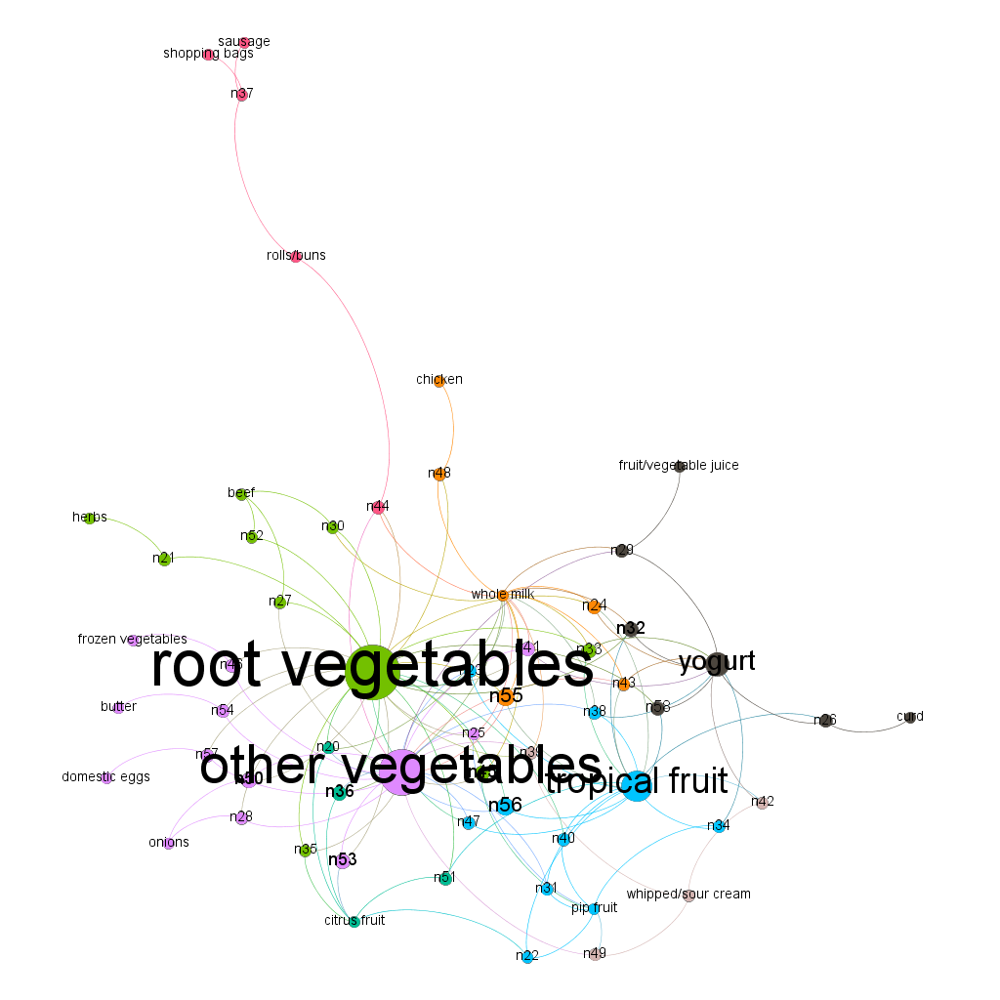

```{r setup, include=FALSE, echo=FALSE}
knitr::opts_chunk$set(echo = FALSE)
```

```{r include=FALSE, echo=FALSE, warnings=FALSE}
library(dplyr)
library(ggplot2)
```

# Data Visualization Part 1

```{r echo=FALSE}

data = read.csv("greenbuildings.csv")
df = data.frame(data)
#convert to categorical
df$green_rating = as.factor(df$green_rating)
df$cluster = as.factor(df$cluster)
df$renovated = as.factor(df$renovated)
df$class_a = as.factor(df$class_a)
df$class_b = as.factor(df$class_b)
df$LEED = as.factor(df$LEED)
df$Energystar = as.factor(df$Energystar)
df$net = as.factor(df$net)
df$amenities = as.factor(df$amenities)
df$class = ifelse(df$class_a=="1", "Class A", ifelse(df$class_b=="1", "Class B", "Class C"))
df$class = as.factor(df$class)
summary(df)
```


Let's take a look at rents by green_rating.
```{r echo=FALSE}
dh <- df %>%
  group_by(green_rating) %>%
  summarize(Median_Rent = median(Rent, na.rm=T))
ggplot(data = dh, aes(green_rating, Median_Rent)) + 
  geom_bar(position="dodge" , stat='identity') +
  labs(title="Rent By Green Rating (Not Controlling for Utilities)", y="Median Rent",x = "Green Rating")
```

Awesome.  As we had assumed, green rated buildings have higher rents.


Let's look at how green rated and non-green rated buildings are classified by quality:

```{r echo=FALSE}
dh <- df %>%
  group_by(green_rating, class) %>%
  summarize(n = n()) %>%
  mutate(frequency = n/sum(n))
dh
```
Most green rated buildings are Class A.  How do rents compare when we control for class?

```{r echo=FALSE}
dh <- df %>%
  group_by(green_rating, class) %>%
  summarize(Median_Rent = median(Rent, na.rm=T))
ggplot(data = dh, aes(green_rating, Median_Rent)) + 
  geom_bar(aes(fill=class), position="dodge" , stat='identity') + 
  labs(title="Rent By Green Rating and Building Class", y="Median Rent",x = "Green Rating")
```

For Class A and B Buildings, the rent is lower for green buildings and substantially higher for Class C Buildings!
```{r echo=FALSE}
dh <- df %>%
  group_by(green_rating, class) %>%
  summarize(AVG_Rent = mean(Rent, na.rm=T))
dh
```


Let's look at renovations now.  First, let's see how old buildings typically are.
```{r echo=FALSE}
dh <- df %>%
  group_by(green_rating, class) %>%
  summarize(Median_Age = median(age, na.rm=T))
ggplot(data = dh, aes(green_rating, Median_Age)) + 
  geom_bar(aes(fill=class), position="dodge" , stat='identity')+
  labs(title="Building Age by Green Rating", y="Median Age",x = "Green Rating")
```

This plot affirms our intuition that green rated buildings are probably newer.

```{r echo=FALSE}
dh <- df %>%
  group_by(green_rating) %>%
  summarize(Percent_Renovated = 100*sum(renovated==1)/n())
ggplot(data = dh) + 
  geom_bar(mapping = aes(x=green_rating, y=Percent_Renovated), stat='identity') + 
  labs(title="Percent Buildings Renovated", y="Percent Renovated",x = "Green Rating")
```

A lower percent of green rated buildings have had renovations.  But wait!  Green rated buildings are typically younger than non-green.  
Let's control for age (Note: This is an approximation.  Renovation is a binary variable, not a count.  It's likely non-green rated under-represents actual renovation count).
```{r echo=FALSE}
dh <- df %>%
  mutate(reno = ifelse(renovated==1, 1, 0)) %>%
  mutate(Renos_per_Year = reno/age) %>%
  group_by(green_rating, class) %>%
  summarize(AVG_Renos_per_Year = mean(reno/age, na.rm=T))
ggplot(data = dh, aes(green_rating, AVG_Renos_per_Year)) + 
  geom_bar(aes(fill=class), position="dodge" , stat='identity') +
  labs(title="Approximate Average Renovations per Building per Year", y="Average Renovations",x = "Green Rating")
```
```{r echo=FALSE}
dh
```
So Class B and C green rated buildings require on average more renovations every year than their non-green rated counterparts.


```{r echo=FALSE}
ggplot(data = dh, aes(green_rating, AVG_Renos_per_Year)) + 
  geom_bar(position="dodge" , stat='identity') + 
  labs(title="Approximate Average Renovations per Building per Year", y="Average Renovations",x = "Green Rating")
```

When controlling for age, green rated buildings are renovated more often than non green rated buildings.


Now let's take a look at occupancy rates.
```{r echo=FALSE}
dh <- df %>%
  group_by(green_rating, class) %>%
  summarize(AVG_Leasing_Rate = mean(leasing_rate, na.rm=T))
ggplot(data = dh, aes(green_rating, AVG_Leasing_Rate)) + 
  geom_bar(aes(fill=class), position="dodge" , stat='identity') + 
  labs(title="Occupancy Rates by Green Rating", y="Occupancy Rate",x = "Green Rating")
dh <- df %>%
  group_by(green_rating) %>%
  summarize(AVG_Leasing_Rate = mean(leasing_rate, na.rm=T))
ggplot(data = dh, aes(green_rating, AVG_Leasing_Rate)) + 
  geom_bar(position="dodge" , stat='identity') + 
  labs(title="Occupancy Rates by Green Rating", y="Occupancy Rate",x = "Green Rating")
```
Green rated buildings have much higher occupancy, even though they have higher rent per square foot.  Let's break this down by amenities to be sure there isn't anything else going on.
```{r echo=FALSE}
dh <- df %>%
  group_by(green_rating, amenities) %>%
  summarize(AVG_Leasing_Rate = mean(leasing_rate, na.rm=T))
ggplot(data = dh, aes(green_rating, AVG_Leasing_Rate)) + 
  geom_bar(aes(fill=amenities), position="dodge" , stat='identity') + 
  labs(title="Average Occupancy Rate by Green Rating and Amenities", y="Occupancy Rate",x = "Green Rating")
```
It doesn't look like the presence of amenities meaningfully changes the behavior of occupancy rates.


Let's look at utilities as another possible explanation.
First, let's look at rent that includes utilities.
```{r echo=FALSE}
dh <- df %>%
  filter(net==1) %>%
  group_by(green_rating, class) %>%
  summarize(AVG_Rent = mean(Rent, na.rm=T))
ggplot(data = dh, aes(green_rating, AVG_Rent)) + 
  geom_bar(aes(fill=class), position="dodge" , stat='identity') + 
  labs(title="", y="Average Rent While Controlling for Utilities",x = "Green Rating")
```
```{r echo=FALSE}
dh
```

When utilities are included in rent, green buildings are actually cheaper for leasees in Class A


In summary, class A and B green rated buildings are about as pricey as their non-green counterparts, when controlling for utilities.  Additionally, based on an approximation, Class A buildings that are green require fewer renovations than non-green Class A buildings.  Last, green rated buildings have higher occupancy rates than non-green buildings.

Ultimately, I would recommend further investigation of renovations of green and non-green buildings.  Specifically, we need to know how expensive green renovations are compared to non-green and how frequently green and non-green buildings require renovations.  That aside, I would recommend moving forward with "going green" for Class A buildings.  Green buildings have a market appeal, bring good PR, and help our customers save money.  Perhaps most importantly, green buildings tend to have much higher occupancy rates.  High occupancy rates will help us market ourselves to investors and allow us to expand more lucratively than we otherwise could.  With a larger operation and economies of scale, we will be able to achieve better margins than we ever could now.


# Data Visualization Part 2

```{r include=FALSE, echo=FALSE, warnings=FALSE}
library(tidyr)
```


```{r echo=FALSE}

df = read.csv("ABIA.csv")
df$Month = as.factor(df$Month)
df$DayofMonth = as.factor(df$DayofMonth)
df$DayofWeek = as.factor(df$DayOfWeek)
df$UniqueCarrier = as.factor(df$UniqueCarrier)
df$FlightNum = as.factor(df$FlightNum)
df$TailNum = as.factor(df$TailNum)
df$Origin = as.factor(df$Origin)
df$Dest = as.factor(df$Dest)
df$CancellationCode = as.factor(df$CancellationCode)
df$Diverted = as.factor(df$Diverted)
```


```{r echo=FALSE}
dh <- df %>%
  mutate(C = ifelse(Cancelled==1, 1,0)) %>%
  group_by(Month, CancellationCode) %>%
  summarize(Count = n()) %>%
  spread(CancellationCode, Count) %>%
  mutate(Carrier_Cancel = A/V1) %>%
  mutate(Weather_Cancel = B/V1) %>%
  mutate(Aviation_System_Cancel = C/V1) %>%
  mutate(Percent_Not_Cancelled = (V1-A-B-C)/V1) %>%
  rename(Count=V1) %>%
  select(-A, -B, -C) %>%
  mutate(Month2 = as.numeric(as.character(Month)))
```

```{r echo=FALSE}
ggplot(data = dh) + 
  geom_bar(mapping = aes(x=Month, y=Count), position="dodge", stat="identity", fill = 'grey30')  +
  geom_line(mapping = aes(x=Month2, y=Carrier_Cancel*max(dh$Count)*30, colour='goldenrod1'), stat="identity", size=2) + 
  geom_line(mapping = aes(x=Month2, y=Weather_Cancel*max(dh$Count)*30, colour='darkorchid1'), stat="identity", size=2) + 
  geom_line(mapping = aes(x=Month2, y=Aviation_System_Cancel*max(dh$Count)*30, colour='steelblue3'), stat="identity", size=2) +
  scale_y_continuous(sec.axis = sec_axis(~./max(dh$Count)/30*100, name="Percent Cancelled")) +
  scale_color_discrete(name = "Cancellation Reason", labels = c("Carrier", "Weather", "National Aviation System"))+
  labs(title="Flights from Austin, 2008", y="Number of Flights",x = "Month") + 
  theme_bw() +
  theme(axis.title.x = element_text(size = 15, vjust=-.2)) +
  theme(axis.title.y = element_text(size = 15, vjust=3)) +
  theme(axis.title.y.right = element_text(angle = 90, hjust=0.5)) +
  theme(title = element_text(size = 20)) + 
  theme(legend.title=element_text(size=12))
  
  #scale_colour_manual(name = 'Cancellation Type', guide = 'Legend',
  #values = c('goldenrod1' = 'goldenrod1', 'darkorchid1' = 'darkorchid1', 'steelblue3' = 'steelblue3'),
  #labels = c('Carrier', 'Weather', 'National Aviation System'))
  #cols <- c("LINE1"="#f04546","LINE2"="#3591d1","BAR"="#62c76b")
```


# Portfolio Modeling

```{r include=FALSE, echo=FALSE, warnings=FALSE}
library(mosaic)
library(quantmod) # quantitative models
library(foreach) # for more sophosticated loops for loops with return values.
```

Our first portfolio consisted of a variety of Long-Short ETFs. This is representative of the portfolio of an active stock trader. The intuition is simple: we invest in stocks that we anticipate to rise in value, but also sell stocks we expect to drop in value. We initially show what one 20-day trading period looks like: we end with $99,281, a .72% loss in wealth. While this is scary, this is only one sample of the population. Therefore, we cannot make an estimate of our average returns with the portfolio. To achieve such estimates, we use bootstrap resampling!
```{r echo=FALSE, warnings=FALSE, message=FALSE}
#Long-Short ETFs
################################################################################
#### Now use a bootstrap approach
#### With more ETFs
myetfs = c("CSM", "QAI", "HDG") # Long-Short ETFs
myprices = getSymbols(myetfs, from = "2014-08-07")
# A chunk of code for adjusting all ETFs
# creates a new object adding 'a' to the end
# For example, WMT becomes WMTa, etc
for(ticker in myetfs) {
  expr = paste0(ticker, "a = adjustOHLC(", ticker, ")")
  eval(parse(text=expr))
}
#head(CSMa)
# Combine all the returns in a matrix long - Short
all_returns = cbind(	ClCl(CSMa),
                     ClCl(QAIa),
                     ClCl(HDGa))
#head(all_returns)
all_returns = as.matrix(na.omit(all_returns))
# Compute the returns from the closing prices
#pairs(all_returns)
set.seed(47)
# Now loop over two trading weeks
total_wealth = 100000
weights = c(0.3,0.4,0.3)
holdings = weights * total_wealth
n_days = 20
wealthtracker = rep(0, n_days) # Set up a placeholder to track total wealth
for(today in 1:n_days) {
  return.today = resample(all_returns, 1, orig.ids=FALSE)
  holdings = holdings + holdings*return.today
  total_wealth = sum(holdings)
  wealthtracker[today] = total_wealth
  weights = c(0.3,0.4,0.3)
  holdings = weights * total_wealth
}
#total_wealth
plot(wealthtracker, type='l')
initial_wealth = 100000
sim1 = foreach(i=1:5000, .combine='rbind') %do% {
  total_wealth = initial_wealth
  weights = c(0.3,0.4,0.3)
  holdings = weights * total_wealth
  n_days = 20
  wealthtracker = rep(0, n_days)
  for(today in 1:n_days) {
    return.today = resample(all_returns, 1, orig.ids=FALSE)
    holdings = holdings + holdings*return.today
    total_wealth = sum(holdings)
    wealthtracker[today] = total_wealth
    weights = c(0.3,0.4,0.3)
    holdings = weights * total_wealth
  }
  wealthtracker
}
# Profit/loss
#mean(sim1[,n_days])
hist(sim1[,n_days]- initial_wealth, breaks=30)
#quantile(sim1[,n_days]- initial_wealth, 0.05)
# End of Long-Short ETFs
################################################################################
```

We created 5000 bootstrap samples which represents 5000 20-day trading periods with our portfolio. To calculate our average return, we average our ending wealth across all 5,000 samples and obtain a mean ending wealth of $100,716! Thus, we estimate that this portfolio has an average return of roughly .7% over a 20-day trading period. Considering that 7-7.5% is the average annual return, this portfolio performs very well for such short time!

How risky is our portfolio though? To quantify the risk at stake with this portfolio we estimate the Value at Risk (henceforth VaR) at a 95% confidence level. We conclude that there is roughly a 5% chance to lose $2,834 over our 20-day period; in other words, 5% of our bootstrap population experienced a loss of \$2,834 or greater during their 20-day trade window.

Our second portfolio consisted of ETFs in the emerging markets. This represents our 'home-run' portfolio and our riskiest portfolio yet. Bear in mind though that emerging markets over a long horizon represent some of the most lucrative returns. Nonetheless, our initial run through one 20-day trade window ended with $100,803. While this outperformed one run of our long-short ETF, we need to bootstrap again to obtain estimates of the average return.
```{r echo=FALSE, warnings=FALSE, message=FALSE}
#Emerging Markets etfs
################################################################################
myetfs = c("RSX", "FM", "ERUS", "GREK", "PIE") # Emerging Markets
myprices = getSymbols(myetfs, from = "2014-08-07")
for(ticker in myetfs) {
  expr = paste0(ticker, "a = adjustOHLC(", ticker, ")")
  eval(parse(text=expr))
}
all_returns = cbind(	ClCl(RSXa),
                     ClCl(FMa),
                     ClCl(ERUSa),
                     ClCl(GREKa),
                     ClCl(PIEa))
#head(all_returns)
all_returns = as.matrix(na.omit(all_returns))
set.seed(55)
# Now loop over two trading weeks
total_wealth = 100000
weights = c(0.2,0.3,0.2,0.2,0.1)
holdings = weights * total_wealth
n_days = 20
wealthtracker = rep(0, n_days) # Set up a placeholder to track total wealth
for(today in 1:n_days) {
  return.today = resample(all_returns, 1, orig.ids=FALSE)
  holdings = holdings + holdings*return.today
  total_wealth = sum(holdings)
  wealthtracker[today] = total_wealth
  #weights = c(0.2,0.3,0.2,0.2,0.1)
  #holdings = weights * total_wealth
}
#total_wealth
plot(wealthtracker, type='l')
initial_wealth = 100000
sim1 = foreach(i=1:5000, .combine='rbind') %do% {
  total_wealth = initial_wealth
  weights = c(0.2,0.3,0.2,0.2,0.1)
  holdings = weights * total_wealth
  n_days = 20
  wealthtracker = rep(0, n_days)
  for(today in 1:n_days) {
    return.today = resample(all_returns, 1, orig.ids=FALSE)
    holdings = holdings + holdings*return.today
    total_wealth = sum(holdings)
    wealthtracker[today] = total_wealth
    weights = c(0.2,0.3,0.2,0.2,0.1)
    holdings = weights * total_wealth
  }
  wealthtracker
}
# Profit/loss
#mean(sim1[,n_days])
hist(sim1[,n_days]- initial_wealth, breaks=30)
#quantile(sim1[,n_days]- initial_wealth, 0.05)
#End of Emerging Markets etfs
################################################################################
```

Once again, we construct 5000 bootstrap samples and estimate an average wealth of $100,002 or .002%  average returns across a 20-day period using our emerging markets portfolio. One would naively assume that such returns are marginal and this portfolio unworthy of consideration, but we remind the reader that emerging markets are lucrative over long-term horizons.

We finally use our bootstrap samples to create a 95% VaR estimate which comes in at $9,556. This explains our portfolio's label as the riskiest. The VaR is almost four times the VaR of our active trader portfolio. So buyers beware, as 5% of you are expected to lose \$10,000 in a 20-day trading period!

Our final portfolio represents a collection of diversified ETFs. This portfolio aims for stability and minimizes its risk by spreading our funds around a variety of asset classes. In other words, this should be our safest portfolio of the three and we should construct our 
expectations accordingly. Our initial 20-day trading period ended with $97,177. 
```{r echo=FALSE, warnings=FALSE, message=FALSE}
#Diversifying etfs
################################################################################
myetfs = c("MDIV", "YYY", "AOM", "AOA", "GAL", "GCE") # Diversifying
myprices = getSymbols(myetfs, from = "2014-08-07")
for(ticker in myetfs) {
  expr = paste0(ticker, "a = adjustOHLC(", ticker, ")")
  eval(parse(text=expr))
}
all_returns = cbind(	ClCl(MDIVa),
                     ClCl(YYYa),
                     ClCl(AOMa),
                     ClCl(AOAa),
                     ClCl(GALa),
                     ClCl(GCEa))
#head(all_returns)
all_returns = as.matrix(na.omit(all_returns))
set.seed(60)
# Now loop over two trading weeks
total_wealth = 100000
weights = c(0.2,0.2,0.1,0.2,0.2,0.1)
holdings = weights * total_wealth
n_days = 20
wealthtracker = rep(0, n_days) # Set up a placeholder to track total wealth
for(today in 1:n_days) {
  return.today = resample(all_returns, 1, orig.ids=FALSE)
  holdings = holdings + holdings*return.today
  total_wealth = sum(holdings)
  wealthtracker[today] = total_wealth
  weights = c(0.2,0.2,0.1,0.2,0.2,0.1)
  holdings = weights * total_wealth
}
total_wealth
plot(wealthtracker, type='l')
initial_wealth = 100000
sim1 = foreach(i=1:5000, .combine='rbind') %do% {
  total_wealth = initial_wealth
  weights = c(0.2, 0.2, 0.1, 0.2, 0.2, 0.1)
  holdings = weights * total_wealth
  n_days = 20
  wealthtracker = rep(0, n_days)
  for(today in 1:n_days) {
    return.today = resample(all_returns, 1, orig.ids=FALSE)
    holdings = holdings + holdings*return.today
    total_wealth = sum(holdings)
    wealthtracker[today] = total_wealth
    weights = c(0.2, 0.2, 0.1, 0.2, 0.2, 0.1)
    holdings = weights * total_wealth
  }
  wealthtracker
}
#head(sim1)
#hist(sim1[,n_days], 25)
# Profit/loss
#mean(sim1[,n_days])
hist(sim1[,n_days]- initial_wealth, breaks=30)
#quantile(sim1[,n_days]- initial_wealth, 0.05)
# End of Diversifying etfs
################################################################################
```

However, when bootstrapping the dataset, we saw a drastically different story. On average, we ended with \$100,363 for an average return of .36%. In terms of risk, our 95% VaR was \$3,648 so, on average, we should expect a 5% chance to lose \$3,647 or greater within a 20-day period.


# Market Segmentation


### Beauty or Fashion

Here we will cluster a sample of Twitter followers into components and determine what market segments should be targeted by NutrientH20.


```{r echo=FALSE}


data=read.csv('social_marketing.csv')

attach(data)


set.seed(357)
artsy_data=data.frame(beauty, fashion)
artsy_scaled=scale(artsy_data)
artsy_distance_matrix = dist(artsy_scaled, method='euclidean')

hier_artsy = hclust(artsy_distance_matrix, method='average')
cluster1 = cutree(hier_artsy, k=3)
#summary(factor(cluster1))


D = data.frame(beauty, fashion, z = cluster1)
ggplot(D) + geom_point(aes(x=beauty, y=fashion, col=factor(z)))
#This shows us that fashion and beauty may be clustered in some way, but from this information,
#we don't know enough yet.  Let's try PCA.


```

We've found an apparent relationship between beauty and fashion, visible in these clusters.  Now let's try a principal compenents analysis on the two interest categories.


```{r, echo=FALSE}

set.seed(357)

Z = data[,c(2:length(data))]/rowSums(data[,c(2:length(data))])

# PCA
pc2 = prcomp(Z, scale=TRUE, rank=5)
loadings = pc2$rotation
scores = pc2$x

data$beauty_fashion=c()
data$beauty_or_fashion=c()

#Label each point based on who tweeted about beauty and/or fashion 4 or more times
for(row in 1:7882){
    if(data[row,29]>=4 & data[row,34]>=4){
      data$beauty_fashion[row]='Beauty and Fashion'
      data$beauty_or_fashion[row]='Beauty or Fashion'
      
    }
    else if(data[row,29]>=4){
      data$beauty_fashion[row]='Beauty'
      data$beauty_or_fashion[row]='Beauty or Fashion'
    }
    else if(data[row,34]>=4){
      data$beauty_fashion[row]='Fashion'
      data$beauty_or_fashion[row]='Beauty or Fashion'
    }
    else{
      data$beauty_fashion[row]='None'
      data$beauty_or_fashion[row]='None'
    }
    
  
    
}

#qplot(scores[,1], scores[,2],col=data$beauty_or_fashion, xlab='Component 1', ylab='Component 2')

qplot(scores[,2], scores[,5],col=data$beauty_or_fashion, xlab='Component 2', ylab='Component 5')+ scale_color_manual(values=c("green", "blue"))

#qplot(scores[,4], scores[,5],col=data$beauty_or_fashion, xlab='Component 4', ylab='Component 5')

#qplot(scores[,1], scores[,3],col=data$beauty_or_fashion, xlab='Component 1', ylab='Component 3')

#qplot(scores[,2], scores[,3],col=data$beauty_or_fashion, xlab='Component 2', ylab='Component 3')

```

There is clearly a cluster here in the top left of the plot, where a market segment of beauty or fashion exists.

```{r}
set.seed(357)
D_SM = dist(scores[,1:5])
hclust_SM = hclust(D_SM, method='average')
#plot(hclust_SM)
c3 = cutree(hclust_SM, 6)
D3 = data.frame(data, z = c3)


#table(D3$beauty_or_fashion)
#table(D3[D3$z==6,]$beauty_or_fashion)
#table(D3[D3$beauty_or_fashion=='Beauty or Fashion',]$z)

#Fraction of each cluster explained by the beauty or fashion label: 
#Over 70% of cluster 6 is explained by it!  This means that we have potentially identified
#cluster 6 as an important market segment of customers who enjoy beauty/fashion.
(table(D3[D3$beauty_or_fashion=='Beauty or Fashion',]$z))/(table(D3$z))


#detach(data)
```
This table represents the percentage of each cluster that contains Twitter followers with either an interest in beauty or fashion.  Cluster 6 is 71% beauty or fashion customers, and all other clusters have fewer than 7%.  It looks like we've identified a significant customer type!  Now let's try to find another.


### "Fit Foodies"

```{r echo=FALSE}
data=read.csv('social_marketing.csv')

data <- data[,-38]
#Z = data/rowSums(data)
data$Label <- NULL
for (i in 1:nrow(data)){
  if (data[i,33] > 6 || data[i,17] > 5){
    data$Label[i] <- 'Fit_Food' #'PF_HN'
  }else{
    data$Label[i] <- 'Other'
  }
}    


data.pca <- data[,-c(1,38)]


Z = data.pca/rowSums(data.pca)

# PCA
set.seed(357)
pc2 = prcomp(Z, scale=TRUE, rank=5)
loadings = pc2$rotation
scores = pc2$x

#qplot(scores[,2], scores[,3],  color = data$Label, xlab='Component 2', ylab='Component 3')
qplot(scores[,2], scores[,5],  color = data$Label, xlab='Component 2', ylab='Component 5')+ scale_color_manual(values=c("red","blue"))
```

Here we see a new type of customers, which we've called "Fit Foodies".  This type contains Twitter followers who frequently tweet about food, nutrition, and personal fitness.  They seem to occupy a different segment of the market than the fashion/beauty group, so let's take a look at the cluster distribution.


```{r echo=FALSE}


D_data = dist(scores[,1:5])
set.seed(357)
hclust_data = hclust(D_data, method='average')
#plot(hclust_data)
c3 = cutree(hclust_data, 6)
D3 = data.frame(data, z = c3)

#count(D3$Label == "Fit_Food")/nrow(D3)

#count(D3$Label == "Fit_Food")/(count(D3$z == 1))
#count(D3$z == 1)

#table(D3[D3$Label == "Fit_Food",]$z)

(table(D3[D3$Label=='Fit_Food',]$z))/(table(D3$z))
```

This is the same table as the one for the beauty fashion group.  The Fit Foodies fill up almost 77% of cluster 1, and no more than 13% of any other cluster.  It looks like we've found a second significant market segment.

### Outdoors/Travel Group?


```{r echo=FALSE, include=FALSE}
library(mosaic)
library(tidyverse)
```


```{r echo=FALSE, warnings=FALSE, message=FALSE}


set.seed(357)
twitter = read.csv('social_marketing.csv')
twitter = twitter[,c(2:37)]

# change our counts to frequencies
Z = twitter/rowSums(twitter)

# PCA
pc1 = prcomp(Z, scale=TRUE, rank=5)
loadings = pc1$rotation
scores = pc1$x

# create a category column regarding our features of interest: outdoors and travel
rowcount = nrow(twitter)
twitter$category = c()
for(i in 1:rowcount)
{
  if(twitter[i,23] >= 4 || twitter[,3] >= 4) {twitter$category[i] = 'outdoors or travel'}
  else {twitter$category[i]= 'none'}
}

# plot our users to their respective components
qplot(scores[,2], scores[,5], col=twitter$category, xlab='Component 2', ylab='Component 5') + scale_color_manual(values=c("blue", "red"))
```


```{r echo=FALSE, warnings=FALSE, message=FALSE}
# cluster based off our components using a distance matrix
D_twitter = dist(scores[,1:5])
set.seed(357)
# hierarchical clustering
hclust_twitter = hclust(D_twitter, method='average')
set.seed(357)
c3 = cutree(hclust_twitter, 6)
D3 = data.frame(twitter, z = c3)

# whats the percent of our cluster in the total sample
#count(D3$category == 'outdoors or travel')/nrow(twitter)

# how do the clusters break down by number of observations
#table(D3$z)
# how do features of interest break down among clusters
#table(D3[D3$category=='outdoors or travel',]$z)
# how do features of interest break down among clusters in percentage
table(D3[D3$category=='outdoors or travel',]$z)/table(D3$z)
detach(data)

```

Here we see a subcategory of the Fit Foodies.  We attempted to find customers who are interested in outdoors and travel, and we can see that they fill some of the Fit Foodies' space, but not all of it.  We believe that outdoors and travel are very broad interests that can be a subgroup of nutrition and personal fitness.  There seems to be an interesection between the two groups, but Fit Foodies are a more unique market segment.  In the table, we see that outdoor/travel customer comprise only 22% of the cluster 1.  Therefore, the two most important market segments that we've identified are the beauty/fashion group and the Fit Foodie group.


# Author Attribution

Before we began pre-processing our data, we had to create an 'author' category. This is because the data is read in without a label category already created and one is needed for our classification problem at hand. Note that the pre-processing we detail are the steps taken for both our training AND test set.

We create two empty lists: an empty list (henceforth file list) to contain each file of the training/test documents, and another empty list that will contain the author's name and their number of writings (henceforth label list). After this, we can now begin to extract the author and file names.

We iterate through every folder name within the corpus and extracts the folder name itself (because each folder represents one author and their writings). The loop continues and extracts the file name of each writing within an author folder before appending the file to our file list. At the end of each loop, we append the author name and their number of files to our label list.

Now that we have our file list, we can read in the files with a readPlain function to read in every file name in English and also assign a unique ID for each file. With this function we assign it to a newly initialized list whose elements are the file names of every document in the training/test directory. However, we check the names of this list and see that the file names still need to be scrubbed as each file ends with a '.txt' extension. 

With our proper file names for every document we create corpuses out of them. We initialize the corpus. Once the corpus is initialized, we need to run some pre-processing on each document. We make everything lowercase and remove any numbers, punctuation, or excess white space. Finally, we remove any words under the 'en' stopwords.

The document-term matrix is now initialized from our cleaned up corpus. In our training DTM, we will remove any sparse terms in the matrix and set our criteria for terms that did not appear in 99% of our documents. In our test DTM, we ensure that all words of the training DTM are included by specifying it as a control within the test DTM initialization. The DTMs use term frequency as their weighting criterion. With our DTMs constructed we can now begin modeling our data and analysis of the model.


```{r echo=FALSE, warning=FALSE, message=FALSE}
## The tm library and related plugins comprise R's most popular text-mining stack.
## See http://cran.r-project.org/web/packages/tm/vignettes/tm.pdf
library(tm) 
library(magrittr)
library(slam) #sparse lightweight
library(proxy)

## tm has many "reader" functions.  Each one has
## arguments elem, language, id
## (see ?readPlain, ?readPDF, ?readXML, etc)
## This wraps another function around readPlain to read
## plain text documents in English.
readerPlain = function(fname){
  readPlain(elem=list(content=readLines(fname)), 
            id=fname, language='en') }

## apply to all of Reuters_train Cowell's articles
## (probably not THE Reuters_train Cowell: https://twitter.com/Reuters_traincowell)
## "globbing" = expanding wild cards in filename paths
Art_dirs = Sys.glob('C50train/*')


#author_dirs = Sys.glob('C:/Users/Dhwani/Documents/Coursework/Summer - Predictive Analytics/STA380/STA380/data/ReutersC50/C50train/*')

file_list = NULL
labels = NULL

for(author in Art_dirs) {
  author_name = substring(author, first=8)
  files_to_add = Sys.glob(paste0(author, '/*.txt'))
  file_list = append(file_list, files_to_add)
  labels = append(labels, rep(author_name, length(files_to_add)))
}

Reuters_train = lapply(file_list, readerPlain) 
# Clean up the file names
# This uses the piping operator from magrittr
# See https://cran.r-project.org/web/packages/magrittr/vignettes/magrittr.html
mynames = file_list %>%
  { strsplit(., '/', fixed=TRUE) } %>%
  { lapply(., tail, n=2) } %>%
  { lapply(., paste0, collapse = '') } %>%
  unlist

names(Reuters_train) = mynames
names(Reuters_train) = sub('.txt', '', names(Reuters_train))


## once you have documents in a vector, you 
## create a text mining 'corpus' with: 
documents_raw = Corpus(VectorSource(Reuters_train))

## Some pre-processing/tokenization steps.
## tm_map just maps some function to every document in the corpus
my_documents = documents_raw
my_documents = tm_map(my_documents, content_transformer(tolower)) # make everything lowercase
my_documents = tm_map(my_documents, content_transformer(removeNumbers)) # remove numbers
my_documents = tm_map(my_documents, content_transformer(removePunctuation)) # remove punctuation
my_documents = tm_map(my_documents, content_transformer(stripWhitespace)) ## remove excess white-space

## Remove stopwords.  Always be careful with this: one person's trash is another one's treasure.
#stopwords("en")
#stopwords("SMART")
#?stopwords
my_documents = tm_map(my_documents, content_transformer(removeWords), stopwords("en"))


## create a doc-term-matrix
DTM_Reuters_train = DocumentTermMatrix(my_documents)
#DTM_Reuters_train # some basic summary statistics


## You can inspect its entries...
#inspect(DTM_Reuters_train[1:10,1:20])

## ...find words with greater than a min count...
#findFreqTerms(DTM_Reuters_train, 50)

## ...or find words whose count correlates with a specified word.
#findAssocs(DTM_Reuters_train, "genetic", .5) 

## Finally, drop those terms that only occur in one or two documents
## This is a common step: the noise of the "long tail" (rare terms)
##	can be huge, and there is nothing to learn if a term occured once.
## Below removes those terms that have count 0 in >99% of docs.  
## Probably a bit stringent here... but only 50 docs!
DTM_Reuters_train = removeSparseTerms(DTM_Reuters_train, 0.99)
#DTM_Reuters_train # now ~ 1000 terms (versus ~3000 before)

# construct TF IDF weights
tfidf_Reuters_train = weightTfIdf(DTM_Reuters_train)

####
# Compare documents
####

# cosine similarity
i = 1
j = 3
#sum(tfidf_Reuters_train[i,] * (tfidf_Reuters_train[j,]))/(sqrt(sum(tfidf_Reuters_train[i,]^2)) * sqrt(sum(tfidf_Reuters_train[j,]^2)))


# Now PCA on term frequencies
X_train = as.matrix(tfidf_Reuters_train)
#summary(colSums(X_train))
scrub_cols = which(colSums(X_train) == 0)
X_train = X_train[,-scrub_cols]

#pca_Reuters_train = prcomp(as.matrix(DTM_Reuters_train))

#X_train_pca = pca_Reuters_train$x[,1:1500]

# If we want to use PCA compressed matricies, we would use pca_Reuters_train$x[,1:1000]

smooth_count = 1/nrow(X_train)
w = rowsum(X_train + smooth_count, labels)
w = w/sum(w)
w = log(w)

#smooth_count_pca = 1/nrow(X_train_pca)
#w_pca = rowsum(X_train_pca + smooth_count, labels)
#w_pca = w_pca/sum(w_pca)
#w_pca = log(w_pca)

##################################################################################################
# Get Test Data
Art_dirs = Sys.glob('C50test/*')


#author_dirs = Sys.glob('C:/Users/Dhwani/Documents/Coursework/Summer - Predictive Analytics/STA380/STA380/data/ReutersC50/C50train/*')

file_list = NULL
test_labels = NULL
author_names = NULL

for(author in Art_dirs) {
  author_name = substring(author, first=8)
  author_names = append(author_names, author_name)
  files_to_add = Sys.glob(paste0(author, '/*.txt'))
  file_list = append(file_list, files_to_add)
  test_labels = append(test_labels, rep(author_name, length(files_to_add)))
}

Reuters_test = lapply(file_list, readerPlain) 

mynames = file_list %>%
  { strsplit(., '/', fixed=TRUE) } %>%
  { lapply(., tail, n=2) } %>%
  { lapply(., paste0, collapse = '') } %>%
  unlist

names(Reuters_test) = mynames
names(Reuters_test) = sub('.txt', '', names(Reuters_test))


## once you have documents in a vector, you 
## create a text mining 'corpus' with: 
documents_raw_test = Corpus(VectorSource(Reuters_test))

## Some pre-processing/tokenization steps.
## tm_map just maps some function to every document in the corpus
my_documents_test = documents_raw_test
my_documents_test = tm_map(my_documents_test, content_transformer(tolower)) # make everything lowercase
my_documents_test = tm_map(my_documents_test, content_transformer(removeNumbers)) # remove numbers
my_documents_test = tm_map(my_documents_test, content_transformer(removePunctuation)) # remove punctuation
my_documents_test = tm_map(my_documents_test, content_transformer(stripWhitespace)) ## remove excess white-space

my_documents_test = tm_map(my_documents_test, content_transformer(removeWords), stopwords("en"))


## create a doc-term-matrix
DTM_Reuters_test = DocumentTermMatrix(my_documents_test, control = list(dictionary=Terms(DTM_Reuters_train)))
#DTM_Reuters_test_pca = DocumentTermMatrix(my_documents_test, control = list(dictionary=Terms(DTM_Reuters_train)))

X_test = as.matrix(DTM_Reuters_test)
#X_test_pca = as.matrix(DTM_Reuters_test_pca)
##################################################################################################################

library(randomForest)
library(caret)
library(e1071)

X <- as.matrix(DTM_Reuters_train)

set.seed(47)

Aut_RF = randomForest(x=X, y=as.factor(labels),ntree=500)

Aut_pred =predict(Aut_RF,newdata=X_test)

Aut_cm = table(substring(Aut_pred,first=2),test_labels)

Aut_cm[1:5,1:5]

#u <- union(Aut_pred, test_labels)
#t <- table(factor(Aut_pred, u), factor(test_labels, u))
cm=confusionMatrix(Aut_cm)
cm$overall


```


We attempted random forest, PCA, and Naive Bayes fits, and our best model was a random forest fit with 500 trees.  The table shown above shows the first 5 rows and columns of the confusion matrix, and the fit was evidently very accurate on some authors (such as Aaron Pressman) and not so accurate on others (such as Alexander Smith).  When using the original training matrix (Without the tf_idf component), we got an accuracy of 65% (accuracy was about 10% lower with the tf_idf weighting included).


```{r echo=FALSE, warning=FALSE, message=FALSE, include=FALSE}

library(arules)  # has a big ecosystem of packages built around it
library(arulesViz)
df <- read.transactions("groceries.txt", sep = ",")
#df$sizes
# Now run the 'apriori' algorithm
# Look at rules with support > .005 & confidence >.1 & length (# artists) <= 5
basketrules = apriori(df, 
                     parameter=list(support=.005, confidence=.1, maxlen=5))
# Look at the output... so many rules!
#inspect(basketrules)
# plot all the rules in (support, confidence) space
# notice that high lift rules tend to have low support
#plot(basketrules)
# "two key" plot: coloring is by size (order) of item set
#plot(basketrules, method='two-key plot')
# can now look at subsets driven by the plot
#inspect(subset(basketrules, support > 0.035))
inspect(subset(basketrules, confidence > 0.3 & lift > 3))
#inspect(subset(basketrules, confidence > 0.25 & lift > 2.5 & support > .009)) #Small subset
# graph-based visualization
sub1 = subset(basketrules, subset=confidence > 0.3 & lift > 3)
#sub1 = subset(basketrules, subset=confidence > 0.25 & lift > 2.5 & support > .009) #Small Subset
#summary(sub1)
#plot(sub1, method='graph')
#?plot.rules
#plot(head(sub1, 100, by='lift'), method='graph')
# export
#saveAsGraph(head(sub1, n = 1000, by = "lift"), file = "basketrules.graphml")
```


# Association rule mining





We reduced our list of association rules to 39. We chose a threshold of confidence > 0.3 and lift > 3. This was done to create a concise list of rules that had high confidence and items that customers were 3x more likely to purchase. Some of these rulese include customers who buy tropical fruit and whipped/sour cream will most likely also buy yogurt (45% confident). This makes sense because the customer is likely shopping for breakfast items or dessert and these all would go together. Another rule to highlight is customers who buy chicken and whole milk will likely buy root vegetables (34% confident). This could be basic essentials for any household or customers making chicken soup.  


