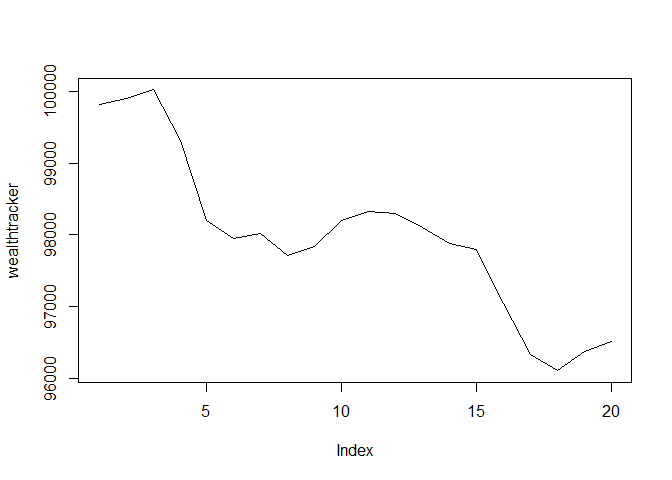
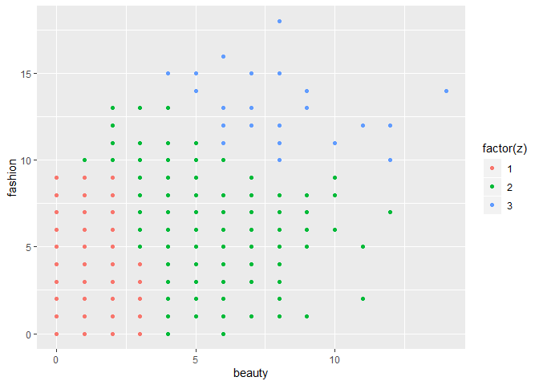

Predictive Modeling Exercises
================
Thomas Bruce, Edward Eustachon, Chris Fitzgerald, and Gabriel James

# Data Visualization Part 1

    ##  CS_PropertyID        cluster          size            empl_gr       
    ##  Min.   :      1   57     :  84   Min.   :   1624   Min.   :-24.950  
    ##  1st Qu.: 157452   396    :  61   1st Qu.:  50891   1st Qu.:  1.740  
    ##  Median : 313253   1070   :  60   Median : 128838   Median :  1.970  
    ##  Mean   : 453003   554    :  59   Mean   : 234638   Mean   :  3.207  
    ##  3rd Qu.: 441188   1195   :  58   3rd Qu.: 294212   3rd Qu.:  2.380  
    ##  Max.   :6208103   415    :  57   Max.   :3781045   Max.   : 67.780  
    ##                    (Other):7515                     NA's   :74       
    ##       Rent         leasing_rate       stories            age        
    ##  Min.   :  2.98   Min.   :  0.00   Min.   :  1.00   Min.   :  0.00  
    ##  1st Qu.: 19.50   1st Qu.: 77.85   1st Qu.:  4.00   1st Qu.: 23.00  
    ##  Median : 25.16   Median : 89.53   Median : 10.00   Median : 34.00  
    ##  Mean   : 28.42   Mean   : 82.61   Mean   : 13.58   Mean   : 47.24  
    ##  3rd Qu.: 34.18   3rd Qu.: 96.44   3rd Qu.: 19.00   3rd Qu.: 79.00  
    ##  Max.   :250.00   Max.   :100.00   Max.   :110.00   Max.   :187.00  
    ##                                                                     
    ##  renovated class_a  class_b  LEED     Energystar green_rating net     
    ##  0:4898    0:4737   0:4267   0:7840   0:7256     0:7209       0:7620  
    ##  1:2996    1:3157   1:3627   1:  54   1: 638     1: 685       1: 274  
    ##                                                                       
    ##                                                                       
    ##                                                                       
    ##                                                                       
    ##                                                                       
    ##  amenities  cd_total_07     hd_total07    total_dd_07   Precipitation  
    ##  0:3737    Min.   :  39   Min.   :   0   Min.   :2103   Min.   :10.46  
    ##  1:4157    1st Qu.: 684   1st Qu.:1419   1st Qu.:2869   1st Qu.:22.71  
    ##            Median : 966   Median :2739   Median :4979   Median :23.16  
    ##            Mean   :1229   Mean   :3432   Mean   :4661   Mean   :31.08  
    ##            3rd Qu.:1620   3rd Qu.:4796   3rd Qu.:6413   3rd Qu.:43.89  
    ##            Max.   :5240   Max.   :7200   Max.   :8244   Max.   :58.02  
    ##                                                                        
    ##    Gas_Costs        Electricity_Costs  cluster_rent       class     
    ##  Min.   :0.009487   Min.   :0.01780   Min.   : 9.00   Class A:3157  
    ##  1st Qu.:0.010296   1st Qu.:0.02330   1st Qu.:20.00   Class B:3627  
    ##  Median :0.010296   Median :0.03274   Median :25.14   Class C:1110  
    ##  Mean   :0.011336   Mean   :0.03096   Mean   :27.50                 
    ##  3rd Qu.:0.011816   3rd Qu.:0.03781   3rd Qu.:34.00                 
    ##  Max.   :0.028914   Max.   :0.06280   Max.   :71.44                 
    ## 

Let’s take a look at rents by green\_rating.
<!-- -->

Awesome. As we had assumed, green rated buildings have higher rents.

Let’s look at how green rated and non-green rated buildings are
classified by quality:

    ## # A tibble: 6 x 4
    ## # Groups:   green_rating [2]
    ##   green_rating class       n frequency
    ##   <fct>        <fct>   <int>     <dbl>
    ## 1 0            Class A  2611    0.362 
    ## 2 0            Class B  3495    0.485 
    ## 3 0            Class C  1103    0.153 
    ## 4 1            Class A   546    0.797 
    ## 5 1            Class B   132    0.193 
    ## 6 1            Class C     7    0.0102

Most green rated buildings are Class A. How do rents compare when we
control for class?

<!-- -->

For Class A and B Buildings, the rent is lower for green buildings and
substantially higher for Class C Buildings\!

    ## # A tibble: 6 x 3
    ## # Groups:   green_rating [2]
    ##   green_rating class   AVG_Rent
    ##   <fct>        <fct>      <dbl>
    ## 1 0            Class A     32.6
    ## 2 0            Class B     26.4
    ## 3 0            Class C     23.9
    ## 4 1            Class A     31.0
    ## 5 1            Class B     26.1
    ## 6 1            Class C     28.2

Let’s look at renovations now. First, let’s see how old buildings
typically are.
<!-- -->

This plot affirms our intuition that green rated buildings are probably
newer.

<!-- -->

A lower percent of green rated buildings have had renovations. But
wait\! Green rated buildings are typically younger than non-green.  
Let’s control for age (Note: This is an approximation. Renovation is a
binary variable, not a count. It’s likely non-green rated
under-represents actual renovation count).
<!-- -->

    ## # A tibble: 6 x 3
    ## # Groups:   green_rating [2]
    ##   green_rating class   AVG_Renos_per_Year
    ##   <fct>        <fct>                <dbl>
    ## 1 0            Class A            0.00846
    ## 2 0            Class B            0.00775
    ## 3 0            Class C            0.00554
    ## 4 1            Class A            0.00688
    ## 5 1            Class B            0.00768
    ## 6 1            Class C            0.00888

So Class B and C green rated buildings require on average more
renovations every year than their non-green rated counterparts.

<!-- -->

When controlling for age, green rated buildings are renovated more often
than non green rated buildings.

Now let’s take a look at occupancy rates.
<!-- --><!-- -->
Green rated buildings have much higher occupancy, even though they have
higher rent per square foot. Let’s break this down by amenities to be
sure there isn’t anything else going on.
<!-- --> It
doesn’t look like the presence of amenities meaningfully changes the
behavior of occupancy rates.

Let’s look at utilities as another possible explanation. First, let’s
look at rent that includes utilities.
<!-- -->

    ## # A tibble: 5 x 3
    ## # Groups:   green_rating [2]
    ##   green_rating class   AVG_Rent
    ##   <fct>        <fct>      <dbl>
    ## 1 0            Class A     25.5
    ## 2 0            Class B     21.8
    ## 3 0            Class C     24.3
    ## 4 1            Class A     24.4
    ## 5 1            Class B     24.2

When utilities are included in rent, green buildings are actually
cheaper for leasees in Class A

In summary, class A and B green rated buildings are about as pricey as
their non-green counterparts, when controlling for utilities.
Additionally, based on an approximation, Class A buildings that are
green require fewer renovations than non-green Class A buildings. Last,
green rated buildings have higher occupancy rates than non-green
buildings.

Ultimately, I would recommend further investigation of renovations of
green and non-green buildings. Specifically, we need to know how
expensive green renovations are compared to non-green and how frequently
green and non-green buildings require renovations. That aside, I would
recommend moving forward with “going green” for Class A buildings. Green
buildings have a market appeal, bring good PR, and help our customers
save money. Perhaps most importantly, green buildings tend to have much
higher occupancy rates. High occupancy rates will help us market
ourselves to investors and allow us to expand more lucratively than we
otherwise could. With a larger operation and economies of scale, we will
be able to achieve better margins than we ever could now.

# Data Visualization Part 2

<!-- -->

# Portfolio Modeling

Our first portfolio consisted of a variety of Long-Short ETFs. This is
representative of the portfolio of an active stock trader. The intuition
is simple: we invest in stocks that we anticipate to rise in value, but
also sell stocks we expect to drop in value. We initially show what one
20-day trading period looks like: we end with $99,281, a .72% loss in
wealth. While this is scary, this is only one sample of the population.
Therefore, we cannot make an estimate of our average returns with the
portfolio. To achieve such estimates, we use bootstrap resampling\!
<!-- --><!-- -->

We created 5000 bootstrap samples which represents 5000 20-day trading
periods with our portfolio. To calculate our average return, we average
our ending wealth across all 5,000 samples and obtain a mean ending
wealth of $100,716\! Thus, we estimate that this portfolio has an
average return of roughly .7% over a 20-day trading period. Considering
that 7-7.5% is the average annual return, this portfolio performs very
well for such short time\!

How risky is our portfolio though? To quantify the risk at stake with
this portfolio we estimate the Value at Risk (henceforth VaR) at a 95%
confidence level. We conclude that there is roughly a 5% chance to lose
$2,834 over our 20-day period; in other words, 5% of our bootstrap
population experienced a loss of $2,834 or greater during their 20-day
trade window.

Our second portfolio consisted of ETFs in the emerging markets. This
represents our ‘home-run’ portfolio and our riskiest portfolio yet. Bear
in mind though that emerging markets over a long horizon represent some
of the most lucrative returns. Nonetheless, our initial run through one
20-day trade window ended with $100,803. While this outperformed one run
of our long-short ETF, we need to bootstrap again to obtain estimates of
the average return.
<!-- --><!-- -->

Once again, we construct 5000 bootstrap samples and estimate an average
wealth of $100,002 or .002% average returns across a 20-day period using
our emerging markets portfolio. One would naively assume that such
returns are marginal and this portfolio unworthy of consideration, but
we remind the reader that emerging markets are lucrative over long-term
horizons.

We finally use our bootstrap samples to create a 95% VaR estimate which
comes in at $9,556. This explains our portfolio’s label as the riskiest.
The VaR is almost four times the VaR of our active trader portfolio. So
buyers beware, as 5% of you are expected to lose $10,000 in a 20-day
trading period\!

Our final portfolio represents a collection of diversified ETFs. This
portfolio aims for stability and minimizes its risk by spreading our
funds around a variety of asset classes. In other words, this should be
our safest portfolio of the three and we should construct our
expectations accordingly. Our initial 20-day trading period ended with
$97,177.

    ## [1] 96515.54

<!-- --><!-- -->

However, when bootstrapping the dataset, we saw a drastically different
story. On average, we ended with $100,363 for an average return of .36%.
In terms of risk, our 95% VaR was $3,648 so, on average, we should
expect a 5% chance to lose $3,647 or greater within a 20-day period.

# Market Segmentation

### Beauty or Fashion

Here we will cluster a sample of Twitter followers into components and
determine what market segments should be targeted by NutrientH20.

<!-- -->

We’ve found an apparent relationship between beauty and fashion, visible
in these clusters. Now let’s try a principal compenents analysis on the
two interest categories.

<!-- -->

There is clearly a cluster here in the top left of the plot, where a
market segment of beauty or fashion exists.

    ## 
    ##           1           2           3           4           5           6 
    ## 0.023169601 0.067281106 0.017421603 0.058592354 0.008050089 0.709035222

This table represents the percentage of each cluster that contains
Twitter followers with either an interest in beauty or fashion. Cluster
6 is 71% beauty or fashion customers, and all other clusters have fewer
than 7%. It looks like we’ve identified a significant customer type\!
Now let’s try to find another.

### “Fit Foodies”

<!-- -->

Here we see a new type of customers, which we’ve called “Fit Foodies”.
This type contains Twitter followers who frequently tweet about food,
nutrition, and personal fitness. They seem to occupy a different segment
of the market than the fashion/beauty group, so let’s take a look at the
cluster distribution.

    ## 
    ##          1          2          3          4          5          6 
    ## 0.76923077 0.10691244 0.07404181 0.08967488 0.02862254 0.12404288

This is the same table as the one for the beauty fashion group. The Fit
Foodies fill up almost 77% of cluster 1, and no more than 13% of any
other cluster. It looks like we’ve found a second significant market
segment.

### Outdoors/Travel Group?

<!-- -->

    ## 
    ##           1           2           3           4           5           6 
    ## 0.223354958 0.018433180 0.006968641 0.010360843 0.011627907 0.022970904

Here we see a subcategory of the Fit Foodies. We attempted to find
customers who are interested in outdoors and travel, and we can see that
they fill some of the Fit Foodies’ space, but not all of it. We believe
that outdoors and travel are very broad interests that can be a subgroup
of nutrition and personal fitness. There seems to be an interesection
between the two groups, but Fit Foodies are a more unique market
segment. In the table, we see that outdoor/travel customer comprise only
22% of the cluster 1. Therefore, the two most important market segments
that we’ve identified are the beauty/fashion group and the Fit Foodie
group.

# Author Attribution

Before we began pre-processing our data, we had to create an ‘author’
category. This is because the data is read in without a label category
already created and one is needed for our classification problem at
hand. Note that the pre-processing we detail are the steps taken for
both our training AND test set.

We create two empty lists: an empty list (henceforth file list) to
contain each file of the training/test documents, and another empty list
that will contain the author’s name and their number of writings
(henceforth label list). After this, we can now begin to extract the
author and file names.

We iterate through every folder name within the corpus and extracts the
folder name itself (because each folder represents one author and their
writings). The loop continues and extracts the file name of each writing
within an author folder before appending the file to our file list. At
the end of each loop, we append the author name and their number of
files to our label list.

Now that we have our file list, we can read in the files with a
readPlain function to read in every file name in English and also assign
a unique ID for each file. With this function we assign it to a newly
initialized list whose elements are the file names of every document in
the training/test directory. However, we check the names of this list
and see that the file names still need to be scrubbed as each file ends
with a ‘.txt’ extension.

With our proper file names for every document we create corpuses out of
them. We initialize the corpus. Once the corpus is initialized, we need
to run some pre-processing on each document. We make everything
lowercase and remove any numbers, punctuation, or excess white space.
Finally, we remove any words under the ‘en’ stopwords.

The document-term matrix is now initialized from our cleaned up corpus.
In our training DTM, we will remove any sparse terms in the matrix and
set our criteria for terms that did not appear in 99% of our documents.
In our test DTM, we ensure that all words of the training DTM are
included by specifying it as a control within the test DTM
initialization. The DTMs use term frequency as their weighting
criterion. With our DTMs constructed we can now begin modeling our data
and analysis of the model.

    ##                   test_labels
    ##                    /AaronPressman /AlanCrosby /AlexanderSmith
    ##   /AaronPressman               47           0               1
    ##   /AlanCrosby                   0          32               0
    ##   /AlexanderSmith               0           0              13
    ##   /BenjaminKangLim              0           0               0
    ##   /BernardHickey                0           0               0
    ##                   test_labels
    ##                    /BenjaminKangLim /BernardHickey
    ##   /AaronPressman                  0              0
    ##   /AlanCrosby                     0              0
    ##   /AlexanderSmith                 0              0
    ##   /BenjaminKangLim               19              0
    ##   /BernardHickey                  0             34

    ##       Accuracy          Kappa  AccuracyLower  AccuracyUpper   AccuracyNull 
    ##      0.6484000      0.6412245      0.6293182      0.6671335      0.0200000 
    ## AccuracyPValue  McnemarPValue 
    ##      0.0000000            NaN

We attempted random forest, PCA, and Naive Bayes fits, and our best
model was a random forest fit with 500 trees. The table shown above
shows the first 5 rows and columns of the confusion matrix, and the fit
was evidently very accurate on some authors (such as Aaron Pressman) and
not so accurate on others (such as Alexander Smith). When using the
original training matrix (Without the tf\_idf component), we got an
accuracy of 65% (accuracy was about 10% lower with the tf\_idf weighting
included).

# Association rule mining

We reduced our list of association rules to 39. We chose a threshold of
confidence \> 0.3 and lift \> 3. This was done to create a concise list
of rules that had high confidence and items that customers were 3x more
likely to purchase. Some of these rulese include customers who buy
tropical fruit and whipped/sour cream will most likely also buy yogurt
(45% confident). This makes sense because the customer is likely
shopping for breakfast items or dessert and these all would go together.
Another rule to highlight is customers who buy chicken and whole milk
will likely buy root vegetables (34% confident). This could be basic
essentials for any household or customers making chicken soup.
