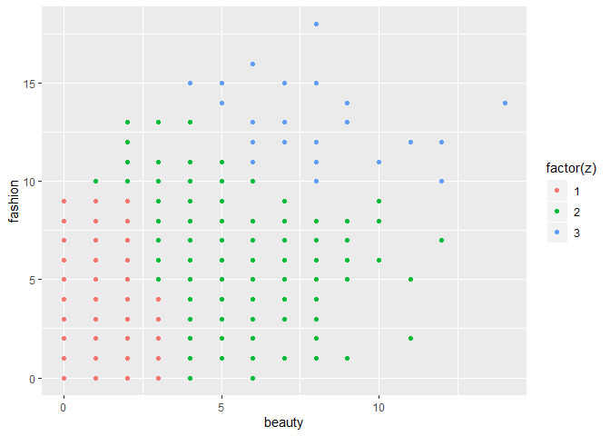
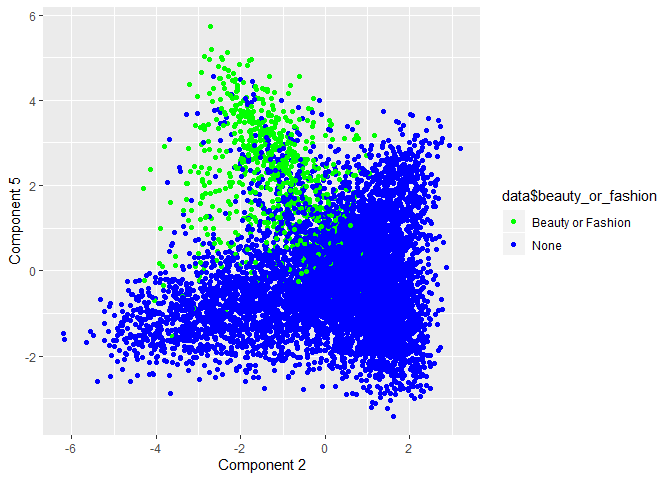
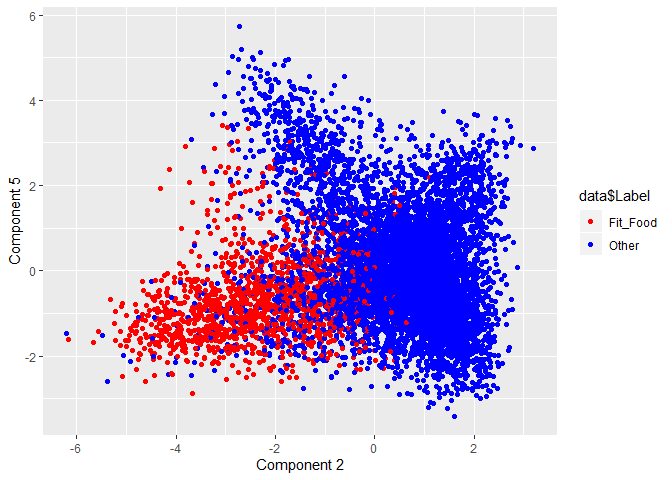

Social Marketing
================

## Beauty or Fashion

Here we will cluster a sample of Twitter followers into components and
determine what market segments should be targeted by NutrientH20.

<!-- -->

We’ve found an apparent relationship between beauty and fashion, visible
in these clusters. Now let’s try a principal compenents analysis on the
two interest categories.

<!-- -->

There is clearly a cluster here in the top left of the plot, where a
market segment of beauty or fashion exists.

    ## 
    ##           1           2           3           4           5           6 
    ## 0.023169601 0.067281106 0.017421603 0.058592354 0.008050089 0.709035222

This table represents the percentage of each cluster that contains
Twitter followers with either an interest in beauty or fashion. Cluster
6 is 71% beauty or fashion customers, and all other clusters have fewer
than 7%. It looks like we’ve identified a significant customer type\!
Now let’s try to find another.

## “Fit Foodies”

<!-- -->

Here we see a new type of customers, which we’ve called “Fit Foodies”.
This type contains Twitter followers who frequently tweet about food,
nutrition, and personal fitness. They seem to occupy a different segment
of the market than the fashion/beauty group, so let’s take a look at the
cluster distribution.

    ## 
    ##          1          2          3          4          5          6 
    ## 0.76923077 0.10691244 0.07404181 0.08967488 0.02862254 0.12404288

This is the same table as the one for the beauty fashion group. The Fit
Foodies fill up almost 77% of cluster 1, and no more than 13% of any
other cluster. It looks like we’ve found a second significant market
segment.

## Outdoors/Travel Group?

<!-- -->

    ## 
    ##           1           2           3           4           5           6 
    ## 0.223354958 0.018433180 0.006968641 0.010360843 0.011627907 0.022970904

Here we see a subcategory of the Fit Foodies. We attempted to find
customers who are interested in outdoors and travel, and we can see that
they fill some of the Fit Foodies’ space, but not all of it. We believe
that outdoors and travel are very broad interests that can be a subgroup
of nutrition and personal fitness. There seems to be an interesection
between the two groups, but Fit Foodies are a more unique market
segment. In the table, we see that outdoor/travel customer comprise only
22% of the cluster 1. Therefore, the two most important market segments
that we’ve identified are the beauty/fashion group and the Fit Foodie
group.
